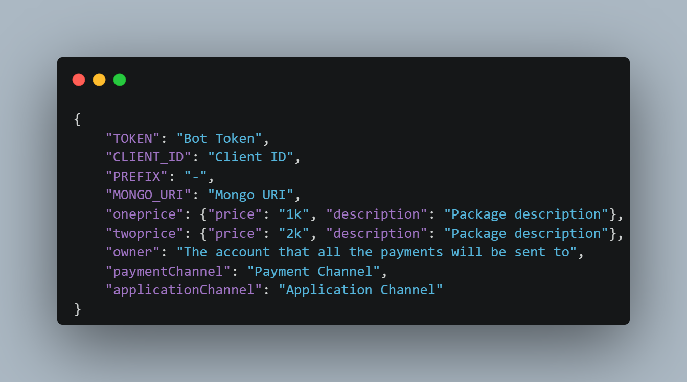

# Sphinx Advert Bot 

<details><summary><b>English</b></summary>
Sphinx Advert Bot is an advertisment bot that allows people to advertise in your server easily and more importantly fast. It was originally made for my desires but now it's for the public.

- Made in **[TS](https://www.typescriptlang.org/)**
- Multiple admissions support, **highly organized**
- Fast.

## Installation Usage
```bash
$ git clone https://github.com/vrzc/ads-botfree.git
$ cd ads-botfree
$ npm i
$ npm i -g typescript
$ tsc
$ npm start
```

## Doing Changes
When editing anything in this project you have to run **tsc** first to publish the updates from ts to js
```bash
$ tsc
$ npm start
```

## Config File
<p align='center'>
    
</p>

## Managing Embeds
Most embeds are located in **[Event Folder](https://github.com/vrzc/ads-botfree/tree/master/src/events)** if you want to edit any embed then please follow this usage.

# Embed Interface
```ts
export interface Embed {
    title?: string,
    url?: string,
    author?: { name: string, icon_url?: string, url?: string},
    description?: string,
    thumbnail?: { url: string },
    fields?: [...{name: string, value: string}],
    image?: { url: string },
    timestamp?: (undefined | string),
    footer?: {text: string, icon_url?: string}
}
```
# Usage
```ts
import {Embed} from "../types.d.ts";
let embed: Embed = {
    title: "Example Title",
    url: "Example URL",
    author: {name: "Example Name", icon_url: "url"}
    description: "Exmaple Description",
    thumbnail: {url: "URL"},
    fields: [{name: "Example name", value: "Example Value"}],
    image: {url: "Example URL"},
    timestamp: new Date().toISOString(),
    footer: {text: "Example Text", icon_url: "Example url"}
};
<I>.reply({embeds: [embed]})
```

## Contributing
I want to make arabs as good as foriegns so the only way you can contribute to this project is by doing tutorials on my codes as i can't rlly do that
</details>
<details><summary><b>Arabic</b></summary>
"Sphinx Advert Bot" هو بوت اعلانات مصمم خصيصا للعرب

- مصنوع بلغة **[TS](https://www.typescriptlang.org/)**
- مصمم لكي يستطيع ان يتحمل اكثر من 5 بلاغات فنفس الوقت
- سريع

## كيفيه التشغيل
```bash
$ git clone https://github.com/vrzc/ads-botfree.git
$ cd ads-botfree
$ npm i
$ npm i -g typescript
$ tsc
$ npm start
```

## عندما يتم تغيير شيء
لما تغير اي شيء فالبروجكت لازم تحدثه لجافا سكربت
```bash
$ tsc
$ npm start
```

## اعدادات البروجكت
<p align="center">
    
</p>

## تغيير اي شيء فالأمبد
اغلب الأمبدز موجوده في
**[Event Folder](https://github.com/vrzc/ads-botfree/tree/master/src/events)**
لو بدك تغير اي شيء عن الأمبد تقدر براحتك لكن تأكد انك تمشي علي الأوبجكت الأساسي
- علامه ال ? معناه انك ما تحتاج تحطه

# اوبجكت الأمبد
```ts
export interface Embed {
    title?: string,
    url?: string,
    author?: { name: string, icon_url?: string, url?: string},
    description?: string,
    thumbnail?: { url: string },
    fields?: [...{name: string, value: string}],
    image?: { url: string },
    timestamp?: (undefined | string),
    footer?: {text: string, icon_url?: string}
}
```

# طريقه الأستعمال
```ts
import {Embed} from "../types.d.ts";
let embed: Embed = {
    title: "Example Title",
    url: "Example URL",
    author: {name: "Example Name", icon_url: "url"}
    description: "Exmaple Description",
    thumbnail: {url: "URL"},
    fields: [{name: "Example name", value: "Example Value"}],
    image: {url: "Example URL"},
    timestamp: new Date().toISOString(),
    footer: {text: "Example Text", icon_url: "Example url"}
};
<I>.reply({embeds: [embed]})
```

## المساعده
لو بدك تساعدني فأني اكمل هاي المشاريع بدي ياك تسوي عنها فيديوهات عشان توصل للكل و الكال يستفيد, اي فيديو تنزله يريت تراسلني علي الديسكورد حقي 
3yl

</details>

### Handler
[TS handler](https://github.com/MericcaN41/discordjs-v14-template-ts)